# Quant

A personal-investor quant workbench for A-share mid/short-term trading decisions. Combines K-line technical patterns, news sentiment, DDE main-fund flow, and a WCMI composite score into a single CRT-style terminal — so one trader can scan the whole market, gate the noise, and reach a buy/hold/skip call in minutes instead of hours.

Engineering rules (highest authority): [`CLAUDE.md`](CLAUDE.md).
Architecture deep-dive: [`docs/architecture.md`](docs/architecture.md).

## Highlights

A terminal-first workbench: every action is a typed command, the same command set is reachable by mouse, keyboard, AI, or IM.

### Market scan — sort by WCMI, drill into one stock

| MKT watch board (sectors + WCMI rank)            | EQ chart + pattern reference matches             |
| ------------------------------------------------ | ------------------------------------------------ |
| 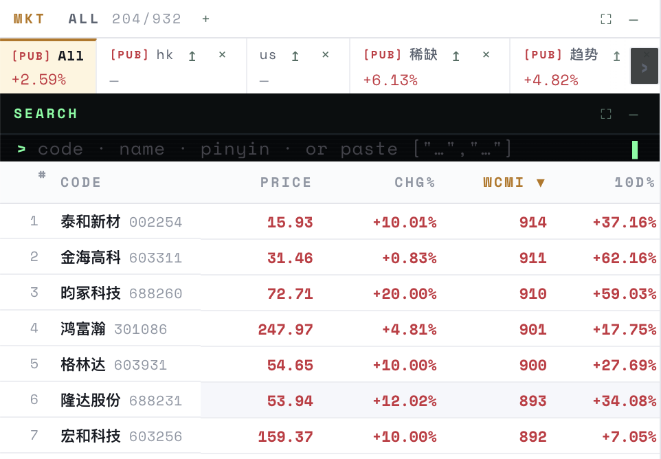        | 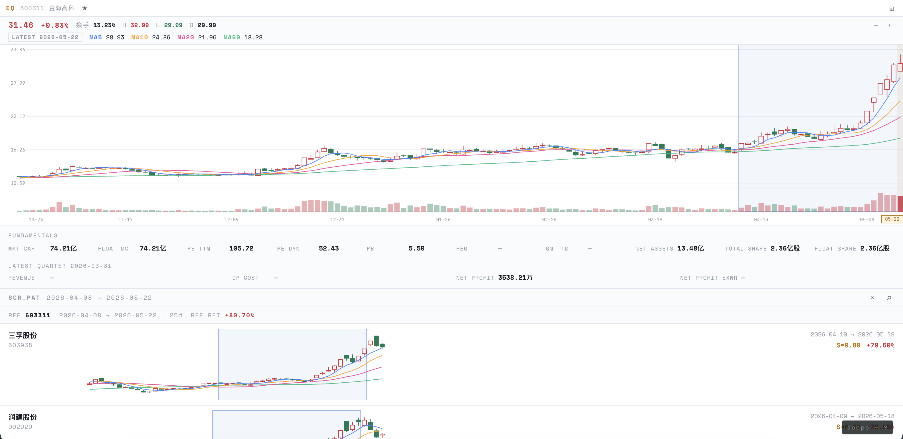       |

### Screener + Watch — NL2DSL gating, then edge-triggered alerts

| `/screen` NL2DSL (Chinese prompt → AST)          | `/watch` groups + pct/abs edge-triggered alerts  |
| ------------------------------------------------ | ------------------------------------------------ |
| 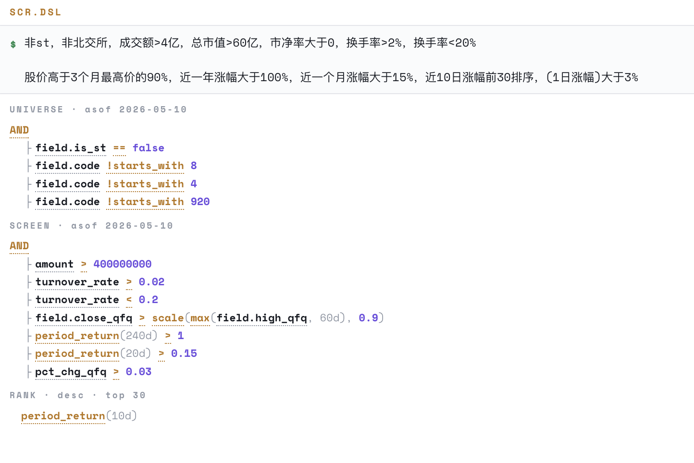         | 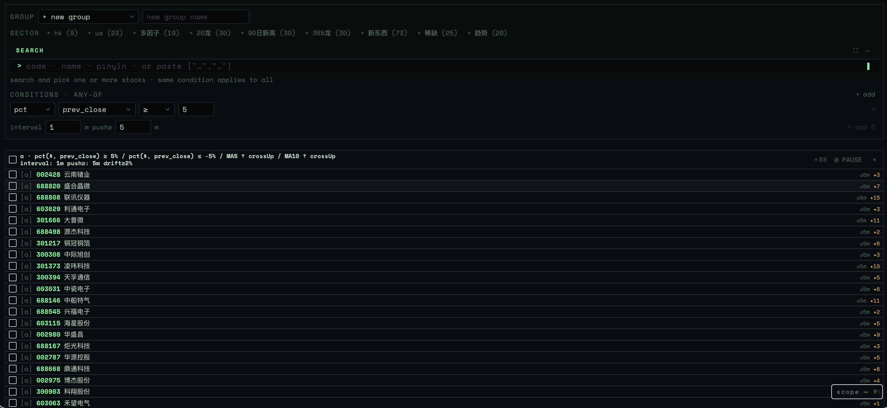      |

### AI briefing — single stock, whole sector, behavior replay

| `/analyze` stock (drivers / themes / signals)    | `/analyze_sector` (themes / style / industry)    |
| ------------------------------------------------ | ------------------------------------------------ |
| 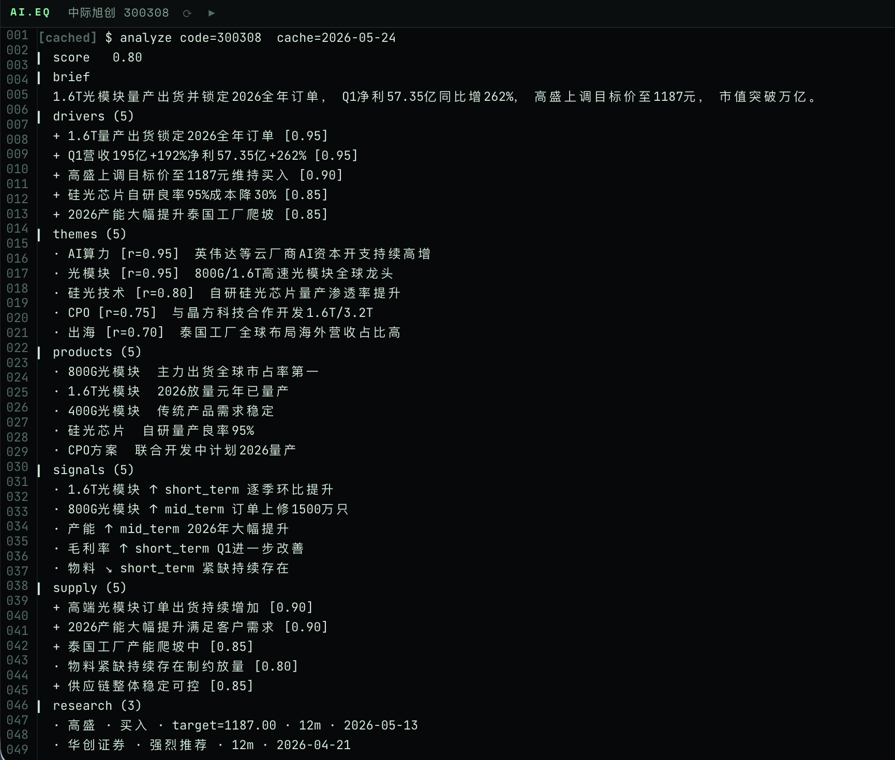       | 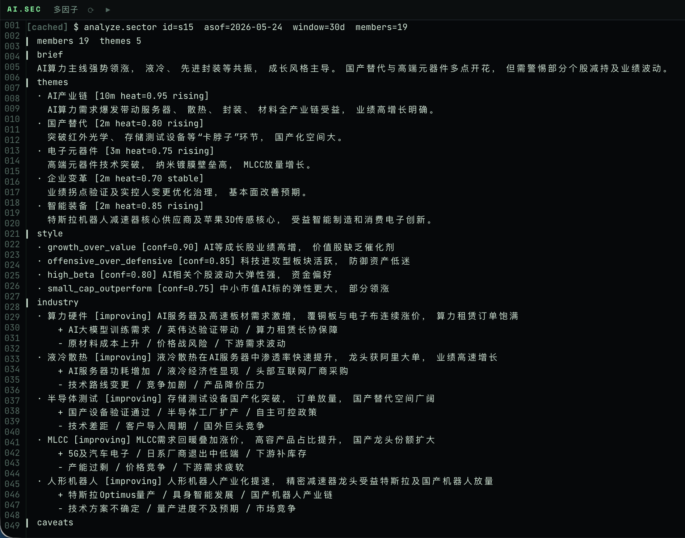      |

Net-flow + AI replay on the EQ detail pane — win rate, profit factor, max drawdown, behavioral profile:

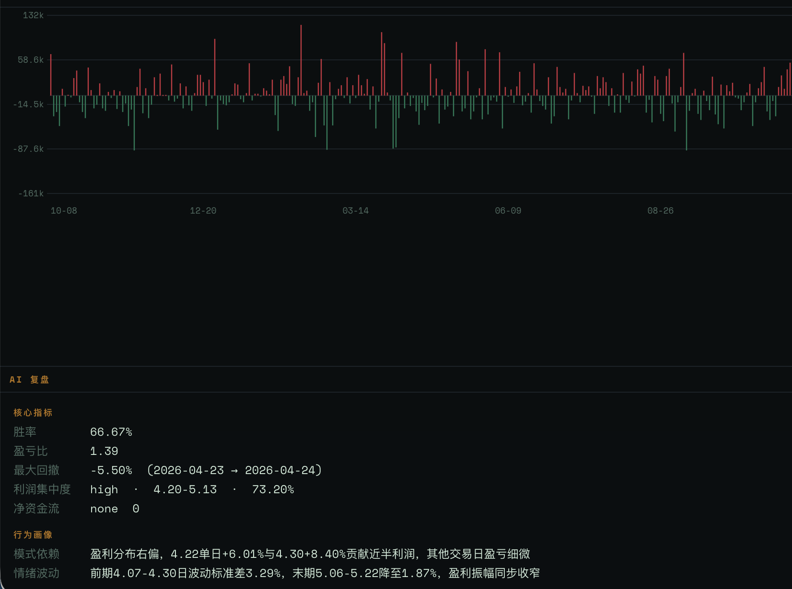

### Backtest evaluation — per-holding-period distribution

`/bt eval` runs every signal day in a window and renders the holding-return distribution (5d / 10d / 20d / …) as histogram + KDE, with sample size, mean, median, win rate, and excess vs market baseline.

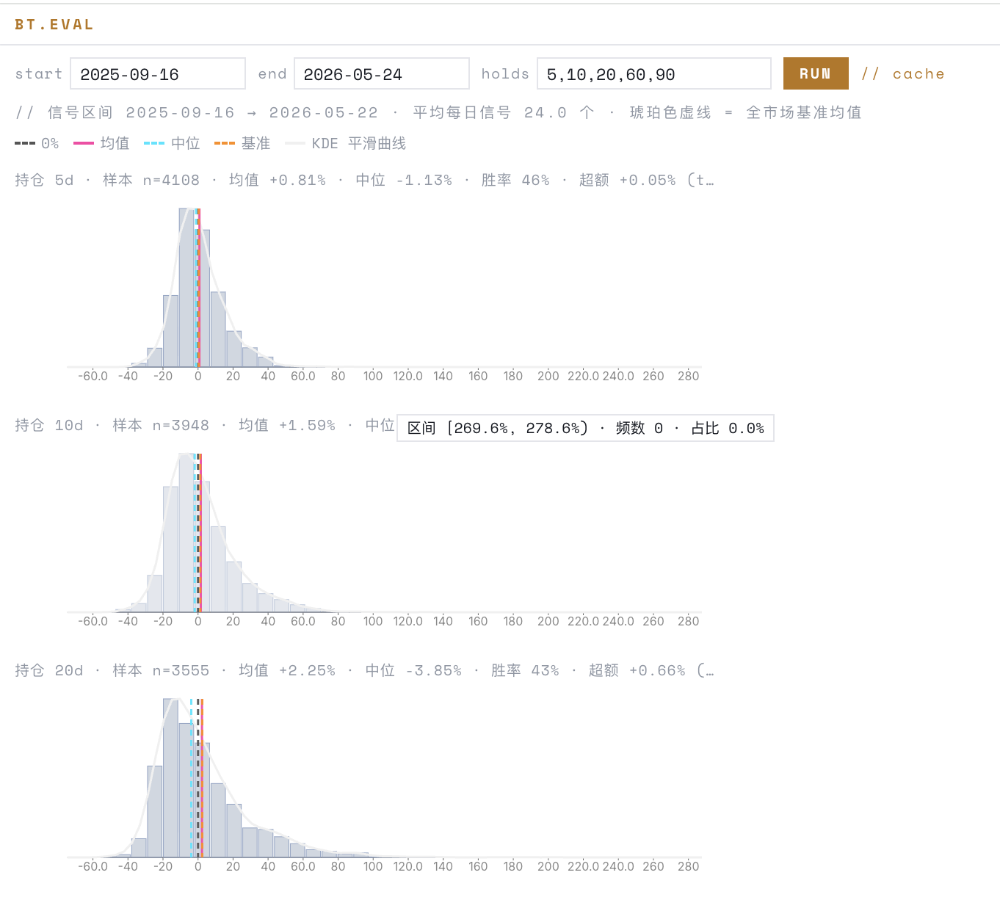

### Terminal-first + IM bridge

| Cheatsheet — every command, mouse-free           | Feishu bot — same instruction set, anywhere      |
| ------------------------------------------------ | ------------------------------------------------ |
| 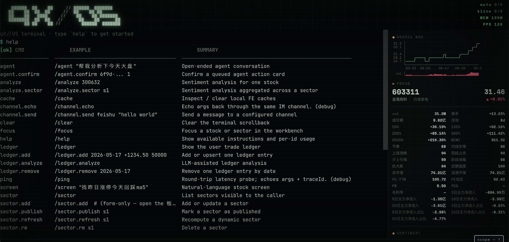              | 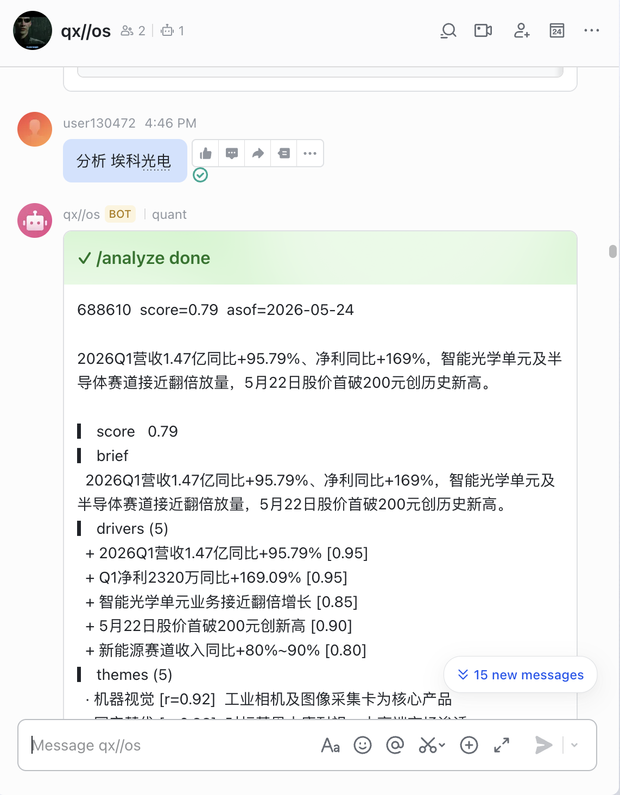      |

### Customize columns + filters

CFG → COLUMNS: applied / available columns, per-column live filters that feed back into the MKT rank.

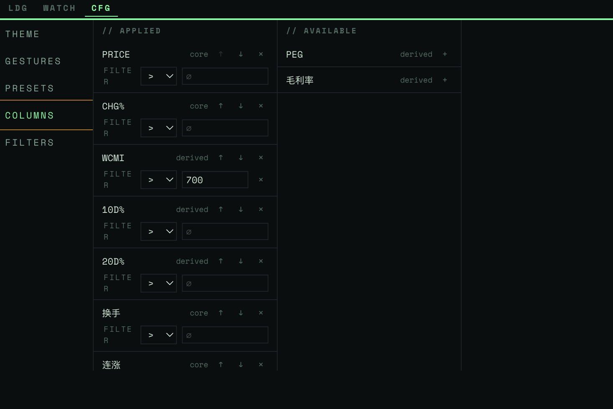

## Usage

1. Boot the dev stack (see [Run](#run)).
2. Open `http://localhost:3000`; the main pane is `TERM.MAIN`, an xterm.js terminal.
3. Type instructions:

| Command    | What it does                                                     |
| ---------- | ---------------------------------------------------------------- |
| `/screen`  | Run a screening DSL or natural-language query (NL2DSL)           |
| `/pattern` | DTW pattern match across the full universe, ranked by similarity |
| `/watch`   | Manage the watchlist + pct/abs edge-triggered alerts             |
| `/analyze` | LLM-backed single-stock or multi-stock briefing                  |
| `/stock`   | Pull K-line, metrics, DDE flow, financials for one symbol        |
| `/sector`  | Sector show / sector-all overview with blacklist applied         |
| `/agent`   | Natural-language entry — the agent picks and chains the above    |

4. Outbound alerts (watch / cron results / agent replies) land in Slack or Feishu; inbound IM commands are dispatched back to the same instruction set.

## Tech stack

| Layer        | Choice                                                              |
| ------------ | ------------------------------------------------------------------- |
| Frontend     | Next.js 14 (App Router) + Chakra UI 3 + TanStack Query + xterm.js   |
| Backend      | NestJS 10 (HTTP gateway, BJT cron, in-memory queues, LLM client)    |
| Compute      | Python 3.11 (akshare IO, screening / pattern / TA / financials)    |
| Cross-proc   | Apache Arrow Flight (gRPC) for columnar; HTTP/JSON for control     |
| Storage      | Parquet + DuckDB column-pruned reads; file-backed JSON KV          |
| Outbound IM  | Redis-backed BullMQ queue (Slack / Feishu, durable retry)          |
| Terminal     | `@quant/terminal` (pure TS engine) + `feat-term-main` xterm host    |

## Quickstart

### Prerequisites

| Tool   | Min     | Install                                            |
| ------ | ------- | -------------------------------------------------- |
| Node   | 20.11   | <https://nodejs.org/> or `nvm install`             |
| pnpm   | 10      | `npm i -g pnpm@10`                                 |
| Python | 3.11    | `pyenv install 3.11`                               |
| uv     | 0.5+    | `curl -LsSf https://astral.sh/uv/install.sh \| sh` |

### Setup

```bash
pnpm install
uv sync
cp .env.example .env
# fill in at least one LLM provider key; akshare needs no key
```

### Key env vars

| Var                                                      | Purpose                                                                     |
| -------------------------------------------------------- | --------------------------------------------------------------------------- |
| `QWEN_API_KEY` / `DEEPSEEK_API_KEY` / `MOONSHOT_API_KEY` | LLM provider keys; catalog picks the first one present                      |
| `LLM_PROVIDER` / `LLM_MODEL`                             | Pin default LLM provider / model                                            |
| `AGENT_LLM_PROVIDER` / `AGENT_LLM_MODEL`                 | Override for the `/agent` scope                                             |
| `AGENT_MAX_TOOL_CALLS`                                   | Per-turn tool-call cap (default 5, clamp 1..10)                             |
| `LLM_REQUEST_TIMEOUT_MS`                                 | Single LLM request timeout (default 60000)                                  |
| `AUTH_MODE`                                              | `disabled` (default, single admin user) or `oauth` (Feishu)                 |
| `INSTRUCTION_IM_ALLOWLIST`                               | Comma-separated IM sender allowlist; empty = open (dev only)                |
| `QUANT_DATA_ROOT`                                        | Data root (default `../../data`); holds Parquet + user-scoped JSON          |
| `CHANNEL_REDIS_URL`                                      | Redis URL for the outbound BullMQ queue (Slack / Feishu)                    |

## Run

Per service:

```bash
pnpm --filter @quant/web dev          # web :3000
pnpm --filter @quant/api dev          # api :3001
uv run python -m quant_rpc            # python flight :8815
```

Or the orchestrated dev script:

```bash
./scripts/dev.sh        # foreground, Ctrl-C stops all
pnpm dev:start          # background + Redis; returns immediately
pnpm dev:status         # PIDs and liveness
pnpm dev:stop           # stop everything
pnpm dev:restart        # = stop + start
```

Background logs land in `.logs/{redis,py,api,web}.log`, pid files in `.logs/<svc>.pid`.

## Test & gate

```bash
# per stack
pnpm --filter @quant/web test:cov
pnpm --filter @quant/api test:cov
uv run pytest services/py/tests --cov=services/py

# full gate (CI required)
pnpm check
```

`pnpm check` runs, in order:

| Step | Command                  | Checks                                  |
| ---- | ------------------------ | --------------------------------------- |
| 1    | `gen:proto:check`        | Generated proto stubs in sync           |
| 2    | `prettier --check .`     | TS formatting                           |
| 3    | `eslint .`               | TS lint (CLAUDE.md §1.2 hard rules)     |
| 4    | `pnpm -r tsc --noEmit`   | TS types                                |
| 5    | `pnpm -r test:cov`       | TS tests + coverage                     |
| 6    | `ruff format --check`    | Py formatting                           |
| 7    | `ruff check`             | Py lint                                 |
| 8    | `mypy --strict`          | Py types                                |
| 9    | `pytest --cov`           | Py tests + coverage (≥ 90%)             |

## Repo layout

```
apps/
  web/             Next.js 14 — UI + xterm.js terminal host
  api/             NestJS 10 — HTTP gateway, cron, queues, LLM client
packages/
  shared/          Cross-app types / zod / errors (core asset, no IO)
  terminal/        @quant/terminal — pure TS command engine
  ui/              Thin React shared components
services/
  py/
    quant_core/    domain / services / ports / adapters
    quant_io/      akshare + OpenAI-compat LLM adapters
    quant_cache/   Parquet repos + DuckDB + FileKeyValueStore
    quant_rpc/     Arrow Flight server + ops registry
proto/             Cross-process contract (errors + codegen)
data/              Local cache (gitignored)
docs/              Engineering docs
```

## Docs

| Path                                  | Content                                          |
| ------------------------------------- | ------------------------------------------------ |
| `CLAUDE.md`                           | Engineering rules (highest authority)            |
| `docs/architecture.md`                | Process topology, data flow, deployment         |
| `docs/glossary.md`                    | Glossary                                         |
| `docs/requirements.md`                | Requirements / user stories                      |
| `docs/modules/01-stock-meta.md`       | Stock meta                                       |
| `docs/modules/02-kline.md`            | K-line + precomputed MA / qfq + range presets    |
| `docs/modules/03-screen.md`           | Screening DSL + NL2DSL                           |
| `docs/modules/04-pattern.md`          | DTW pattern match, full-universe similarity     |
| `docs/modules/05-sentiment.md`        | News sentiment (LLM web_search)                  |
| `docs/modules/06-watch.md`            | Watchlist + edge-triggered alerts                |
| `docs/modules/07-orchestration.md`    | BJT 16:00 cron + in-memory queues                |
| `docs/modules/08-frontend.md`         | Feat framework + Feat catalog                    |
| `docs/modules/09-notifications.md`    | Slack mrkdwn notifications                       |
| `docs/modules/10-terminal.md`         | `@quant/terminal` + `TERM.MAIN`                  |
| `docs/modules/11-channel.md`          | IM channel (Slack / Feishu) inbound + outbound   |
| `docs/modules/12-blacklist.md`        | A-share noise blacklist                          |
| `docs/modules/12-socket.md`           | Socket.IO topics (watch / queue / channel)       |
| `docs/modules/13-ledger.md`           | Per-user LLM token ledger                        |
| `docs/modules/15-instructions.md`     | Instruction set + `/agent` natural-language     |
| `docs/modules/16-ta.md`               | Technical-analysis indicators + WCMI score       |
| `docs/integrations/auth.md`           | AUTH_MODE + Feishu OAuth + IM sender derivation  |
| `docs/integrations/data-sources.md`   | akshare adapters                                 |
| `docs/integrations/llm-providers.md`  | LLM provider abstraction                         |
| `docs/integrations/ipc-py-ts.md`      | Arrow Flight ops + contract                      |
| `docs/integrations/cache-strategy.md` | File cache primitives + invariants               |
| `docs/perf/`                          | Performance investigations + benchmarks          |
| `docs/rfcs/`                          | Historical RFCs                                  |

## Architecture

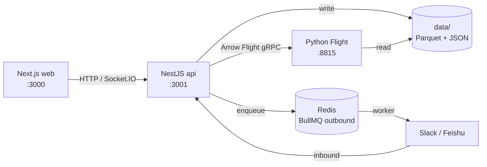
