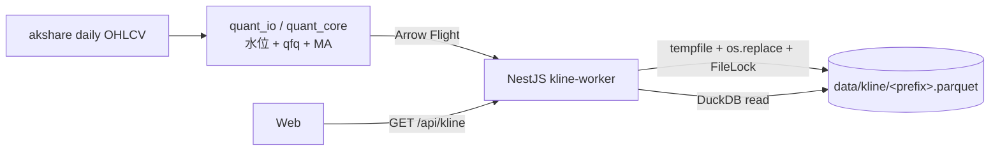

# K-line — 日线行情

## 功能

- 日线 OHLCV + 复权因子 + 预计算技术指标（MA5/10/20/60）。
- 增量更新：按交易日水位只补缺失区间。
- 给筛选 / 形态 / 图表 / 终端统一供数。

## 实现

| 层      | 位置                                                 | 说明                                                                       |
| ------- | ---------------------------------------------------- | -------------------------------------------------------------------------- |
| Source  | `quant_io/sources/akshare_kline.py`                  | 单代码 / 区间拉取，自动重试                                                |
| Repo    | `quant_cache/parquet_kline_repo.py`                  | 按 3 位 code 前缀分片为 `data/kline/<prefix>.parquet`（约 13 个 flat 文件）；DuckDB 读取（列裁剪 + 谓词下推）|
| Service | `quant_core/services/kline_service.py`               | 读 / 写 / 水位查询，封装前复权计算与 MA 预计算                             |
| RPC     | `quant_rpc/ops/kline_*.py` + `financials_*.py`       | 见下表                                                                     |
| API     | `apps/api/src/modules/kline/`                        | `GET /api/kline/{code}?range=30D|50D|90D|250D`，bulk last-N 内部走 RPC     |
| Web     | `feat-eq-chart`、`feat-eq-list`、`feat-scr-pat`      | lightweight-charts K 线图 + 列表 / 形态命中行                              |
| Worker  | `apps/api/src/modules/orchestration/kline-worker.ts` | 入队批量同步                                                               |

## Flight ops

| op                                                                              | 用途                                   |
| ------------------------------------------------------------------------------- | -------------------------------------- |
| `list_kline_for_code`                                                           | 单只最近 N 条 OHLCV（带 qfq + ma）     |
| `list_kline_bulk_last_n`                                                        | 批量 / 全宇宙最近 N 条                 |
| `list_kline_watermarks`                                                         | 各 code 当前最新交易日（同步巡检用）   |
| `sync_kline_for_code`                                                           | 触发拉取 + 落库                        |
| `list_stock_snapshots`                                                          | 5D OHLCV + 元信息聚合（终端 / 列表用） |
| `get_latest_trade_day`                                                          | 交易日历查询                           |
| `bulk_sync_financials` / `enrich_financials_for_code` / `find_stale_financials` | 财务字段同步 / 巡检                    |

## 数据流

## 落库规约

落库时**预计算**并写入：

- 前复权价：以最新复权因子 $f_T$ 为基准，历史价 $p_t$ 调整为

$$p_t^{\mathrm{qfq}} = p_t \cdot \frac{f_t}{f_T}$$

  四列 `open_qfq / high_qfq / low_qfq / close_qfq` 都按此公式计算。

- 移动平均线（基于 $\text{close\_qfq}$）：

$$\mathrm{MA}_n(t) = \frac{1}{n} \sum_{i=t-n+1}^{t} \text{close\_qfq}_i, \quad n \in \{5, 10, 20, 60\}$$

下游（screen / pattern / 图表）一律读 qfq 列，禁止再算一次。

## Range 预设

`30D / 50D / 90D / 250D` 四档（见 `apps/api/src/modules/kline/dto/`）。`50D` 用于 SCR.PAT 中嵌入的相似形态预览。

## 缓存策略

- **路径**：`data/kline/<prefix>.parquet`（按 6 位 code 的前 3 位分片，约 13 个 flat 文件；明细见 `docs/perf/kline-write.md`）。
- **写入**：`tempfile + os.replace` + `FileLock(<prefix>.lock)`，读端无锁。
- **增量**：`list_kline_watermarks` 报告水位；同步只拉 $(\text{watermark}, \text{today}]$。
- **读取**：DuckDB 直读 Parquet，按需选列（`SELECT trade_date, close_qfq, ma20 …`）。
- **schema 演进**：Parquet metadata 含 `schema_version`，不匹配触发整文件重建（在 `kline_schema.py` 定义）。
