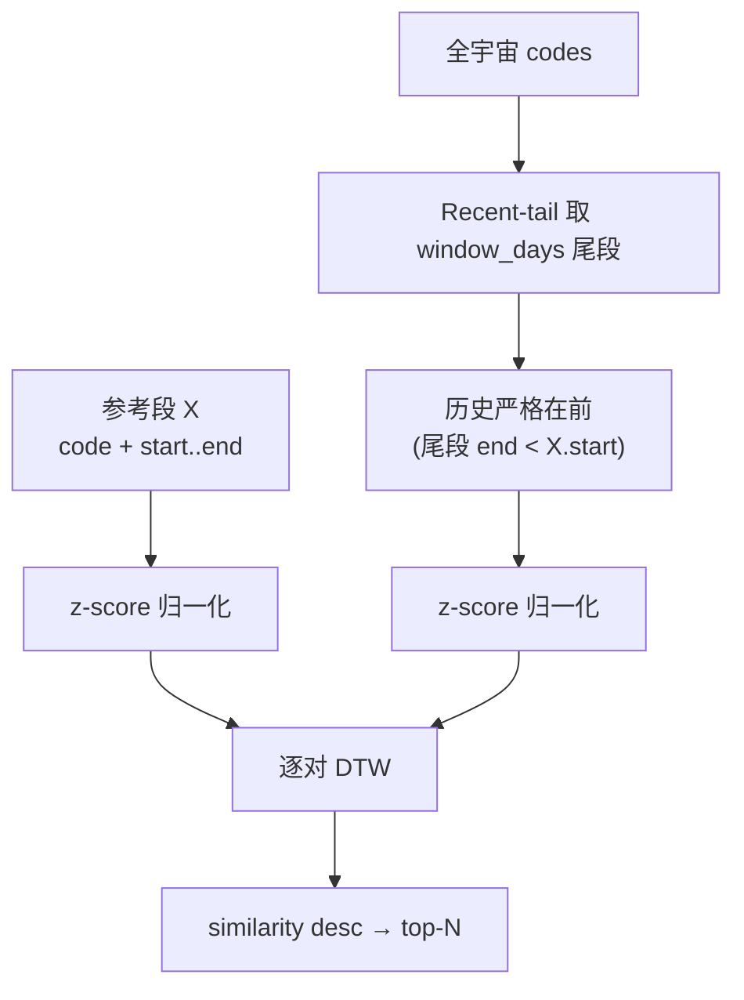

# Pattern — 形态匹配

## 功能

- 给定一只股票一段历史 K 线段（"参考形态"），在全市场最近行情中找形态相似的股票。
- 输出按相似度（z-score 归一化后 DTW 距离的反序）排序的 top-N 列表，配合 SCR.PAT 内嵌 50D K 线行展示。

## 实现

| 层      | 位置                                     | 说明                                                         |
| ------- | ---------------------------------------- | ------------------------------------------------------------ |
| Types   | `quant_core/domain/types/pattern.py`     | `PatternQuery`、`PatternHit`、`Distance`                     |
| Engine  | `quant_core/adapters/pattern/`           | DTW 实现（pure Python + numpy）                              |
| Service | `quant_core/services/pattern_service.py` | 归一化 → 距离 → similarity rank                              |
| RPC     | `quant_rpc/ops/pattern.py`               | op = `find_similar_patterns`                                 |
| API     | `apps/api/src/modules/pattern/`          | `POST /api/pattern/find-similar`                             |
| Web     | `feat-scr-pat`                           | 选锚点股 + 区间 → 命中列表（含每行内嵌 50D K 线 + 期间收益） |

## 算法

设参考段为 $X = (x_1, \dots, x_n)$，候选段为 $Y = (y_1, \dots, y_n)$（同长 = $\text{window\_days}$）。

1. **z-score 归一化**：

$$\tilde{x}_i = \frac{x_i - \mu_X}{\sigma_X}, \quad \tilde{y}_i = \frac{y_i - \mu_Y}{\sigma_Y}$$

2. **DTW 距离**：动态规划求允许时间轴拉伸的最小累积距离

$$D(i,j) = |\tilde{x}_i - \tilde{y}_j| + \min\bigl(D(i-1,j),\ D(i,j-1),\ D(i-1,j-1)\bigr)$$

$$\text{distance}(X,Y) = D(n,n)$$

3. **相似度排名**：

$$\text{similarity} = \frac{1}{1 + \text{distance}(X,Y)} \in (0, 1]$$

## 扫描流程

## 行为约束

- **全宇宙扫描**：`find_similar_patterns` 始终在全宇宙上跑（避免用户错传 universe 漏掉真实相似股）。
- **窗口**：`window_days` 由参考段长度推导，**不再**按 `start..end` 日期差计算。
- **历史严格在前**：扫描候选股的窗口严格在参考起始日之前，杜绝前视偏差。
- **Recent-tail 扫描 + similarity rank**：候选只取每只股票最近 `window_days` 的尾段。
- **归一化**：z-score；输入 / 候选段共享同一管线。

## 缓存策略

- **K 线**：复用 `data/kline/*.parquet`。
- **结果**：不缓存——锚点窗口随交易日滚动，且 top-N 由调用方决定。
