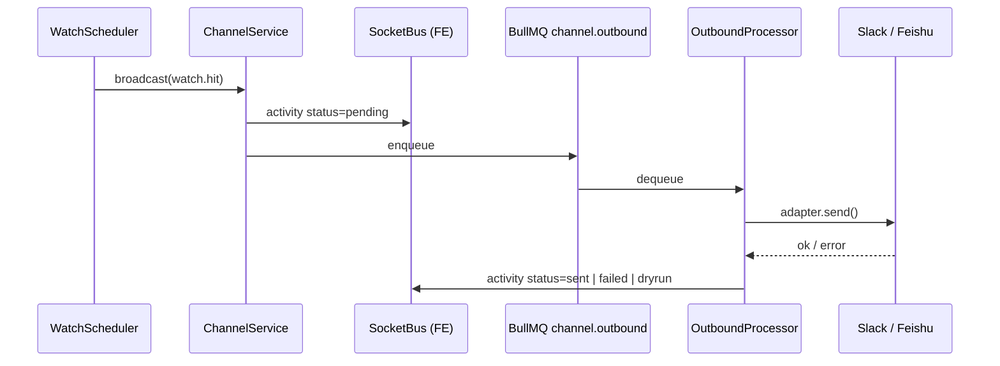
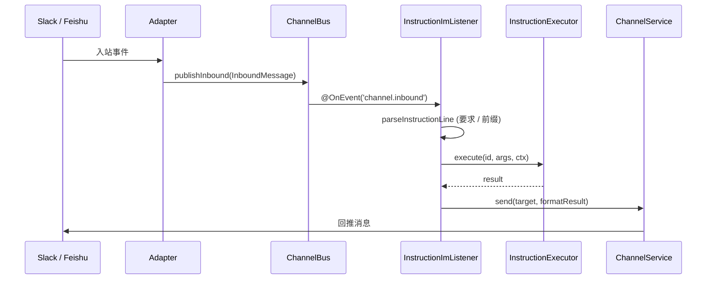

# Channel — 多 IM 推送 / 订阅模块

## 功能

- 统一的多 IM (slack / feishu，可扩展) outbound + inbound 模块。
- **outbound**：watch / cron / 手动触发 → IM。使用各 IM 的 Web API（如 Slack `chat.postMessage`、Feishu `im.message.create`）而非 webhook —— 拿到更强的能力（attachments / cards / 撤回 / 编辑 / 阅读状态等）。
- **inbound**：通过 Slack Socket Mode + Feishu 长连接（WSClient）订阅 IM 事件，落到内部 Bull 队列，其它 module 通过 `@OnEvent('channel.inbound:slack')` 等订阅。
- 所有事件（系统推送 / 手动 / 订阅入站）会同步推到 `channel.activity` socket topic，前端 `feat-channel` 实时呈现。

## 进程拓扑

```
NestJS API process
├─ ChannelModule
│  ├─ adapters/{slack,feishu}.adapter.ts     # Web API + Socket-Mode/WSClient
│  ├─ bus/channel-bus.service.ts             # BullMQ outbound + activity 队列入口
│  ├─ bus/outbound.processor.ts              # BullMQ Worker：发送、写 activity
│  ├─ channel.registry.ts                    # 生命周期 + inbound 路由
│  ├─ channel.service.ts                     # 公共门面（broadcast / send）
│  ├─ instructions/channel-send.handler.ts   # 注册 channel.send InstructionSpec
│  └─ channel.controller.ts                  # POST /api/channel/send  GET /api/channel/list
└─ Redis (BullMQ) ── 队列名 channel.outbound
```

## 数据流

### 系统推送（watch.hit）



步骤说明：

1. `WatchScheduler` 命中 → `ChannelService.broadcast({ kind: 'watch.hit', ... }, { source: 'system' })`。
2. `ChannelService` 立刻发一行 `status='pending'` 的 `ChannelActivity` 给 `SocketBus`（前端瞬时反馈）。
3. 入队 `channel.outbound`（BullMQ 持久化、可重试）。
4. `OutboundProcessor` 从队列取出，调对应 `ChannelAdapter.send()`。
5. 完成后再发一行 `status='sent' | 'failed' | 'dryrun'` 的 `ChannelActivity`，前端覆盖原行（按 `id` 折叠）。

### IM 入站

1. Slack Socket Mode / Feishu WSClient 收到事件 → adapter 标准化为 `InboundMessage`。
2. `ChannelRegistry.onInbound` → `ChannelBus.publishInbound`：
   - 通过 `SocketBus.emit('channel.activity', ...)` 推前端。
   - 通过 `EventEmitter2.emit('channel.inbound', ...)`/`channel.inbound:<id>` 让其它 module 用 `@OnEvent` 订阅。

### 前端 → 后端命令

- 前端 socket `command` 包 `{ id: 'channel.send', args: { channel, text, target? } }`；服务端 `SocketInstructionAdapter` → `InstructionExecutor` → `ChannelSendHandler.execute` → `ChannelService.send(...)`。所有 socket 命令都经统一 [`InstructionRegistry`](./15-instructions.md)，没有 channel 专属分支。
- 当前未在 UI 暴露入口（feat-channel 暂为只读 feed）；写第一个调用点即可启用。

### IM 入站 → 指令回复闭环



1. Slack/Feishu 入站消息经 `ChannelBus.publishInbound` 发出 `channel.inbound` 事件。
2. `InstructionImListener` 订阅该事件，用共享 `parseInstructionLine(text, knownIds, { requirePrefix: true })` 解析。
3. 没有 `/` 前缀的消息默认静默；allowlist 内 sender 会路由到 `/agent q="<原文>"`。
4. 匹配到 spec 则交给 `InstructionExecutor` 执行。
5. 结果 `formatResult(...)` 后通过 `ChannelService.send(channel, { kind: 'instruction.reply', target: msg.target ?? msg.sender }, ...)` 回推到同一频道。

## 配置（`apps/api/.env`）

| 名称                             | 必需           | 默认                       | 说明                               |
| -------------------------------- | -------------- | -------------------------- | ---------------------------------- |
| `CHANNEL_ENABLED`                | 否             | 空（不启用任何 IM）        | 逗号分隔，如 `slack,feishu`。      |
| `CHANNEL_DRY_RUN`                | 否             | `false`                    | 强制 dry-run（仅日志，不发请求）。 |
| `CHANNEL_REDIS_URL`              | 启用任一通道时 | `redis://127.0.0.1:6379`   | BullMQ 连接。                      |
| `CHANNEL_BULL_PREFIX`            | 否             | `quant:channel`            | 队列前缀，多环境隔离用。           |
| `CHANNEL_SLACK_BOT_TOKEN`        | 启用 slack 时  | —                          | `xoxb-...`，Web API。              |
| `CHANNEL_SLACK_APP_TOKEN`        | 否             | —                          | `xapp-...`，启用入站时必须。       |
| `CHANNEL_SLACK_DEFAULT_CHANNEL`  | 否             | `#quant-signals`           | 不指定 target 时的默认频道。       |
| `CHANNEL_FEISHU_APP_ID`          | 启用 feishu 时 | —                          | `cli_...`。                        |
| `CHANNEL_FEISHU_APP_SECRET`      | 启用 feishu 时 | —                          | 配合 app id 拿 tenant token。      |
| `CHANNEL_FEISHU_DEFAULT_CHAT_ID` | 否             | 空（不指定 target 即报错） | 默认推送的 chat*id（`oc*...`）。   |

## HTTP 路由

- `GET /api/channel/list` — 返回 `ChannelStatus[]`（启用 / 就绪 / 入站连接状态）。
- `POST /api/channel/send` — 接 `ChannelOutboundRequest`（zod 校验），返回 `{ accepted, activityIds }`。

## 测试

- `apps/api/test/modules/channel/channel-config.spec.ts`：env 解析（缺 token、未启用、白名单过滤）。
- `apps/api/test/modules/channel/channel.service.spec.ts`：广播 / 单发 / 与 registry 取交集 / 元数据透传。
- `apps/api/test/modules/instruction/*`：socket / IM / executor 单测（覆盖 channel.send + ping + IM 静默 + parse 错回复）。
- adapter 单测 mock SDK；inbound 长连接走端到端契约测试（参考 `docs/integrations/ipc-py-ts.md`）。

## 复用

- watch hit 触发路径统一走 `ChannelService.broadcast`。
- 手动外发走 `POST /api/channel/send`。
- 共享 schema 在 `packages/shared/src/types/channel.ts` 与 `packages/shared/src/types/socket.ts`，TS 双侧用同一份 zod。
